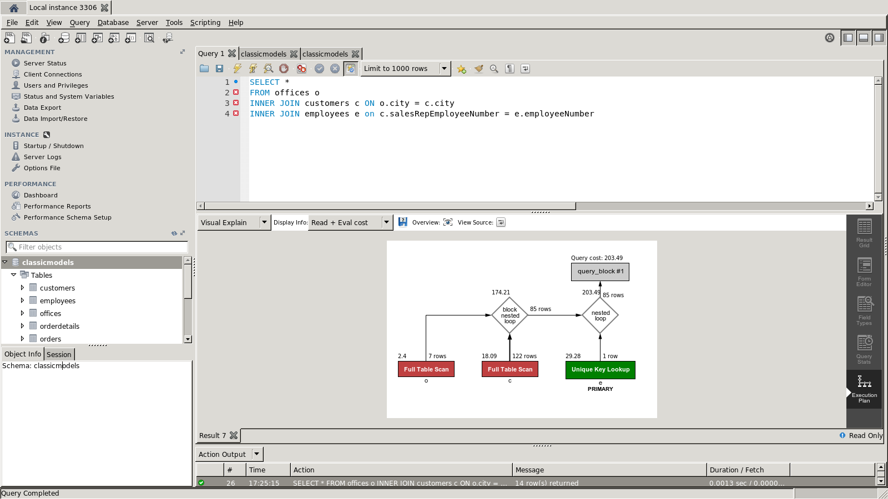
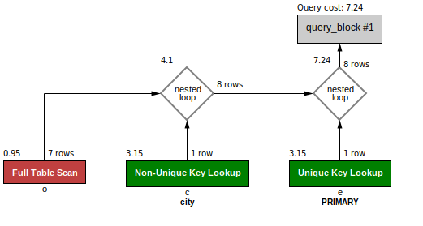
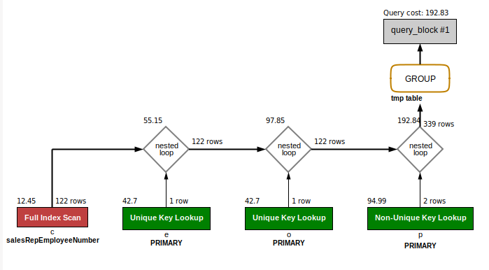
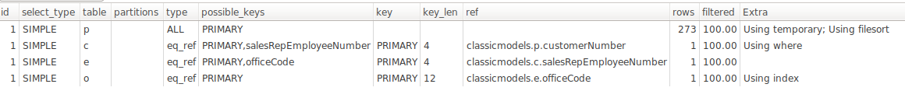

# Task-6

### Made by David Carl & Tjalfe Møller
### www.dcarl.me

## Excersise 1

### Description

In the ```classicmodels``` database, write a query that picks out those customers who are in the same city as office of their sales representative.

### Answer

```
SELECT *
FROM offices o
INNER JOIN customers c ON o.city = c.city
INNER JOIN employees e ON c.salesRepEmployeeNumber = e.employeeNumber
```



The problem with this query would <
## Excersise 2

### Description

Change the database schema so that the query from exercise get better performance.

### Answer

By adding an index on city on the customer object we can make the query only ready in the same city as the offices.
This greatly reduce the query cost.



## Excersise 3

### Description

We want to find out how much each office has sold and the max single payment for each office. Write two queries which give this information

a) using grouping
b) using windowing

For each of the two solutions, check its graphical execution plan.

### Answer

Grouping:

```
SELECT o.officeCode, sum(p.amount) as Total, max(p.amount) as maxPayment
FROM classicmodels.payments as p
inner join customers c on p.customerNumber = c.customerNumber
inner join employees e on c.salesRepEmployeeNumber = e.employeeNumber
inner join offices o on e.officeCode = o.officeCode
group by o.officeCode;
```



Windowing:

```
SELECT DISTINCT o.officeCode, SUM(p.amount) OVER (PARTITION BY o.officeCode ) as Total, MAX(p.amount) OVER (PARTITION BY o.officeCode) as MaxPayment
FROM payments p
INNER JOIN customers c on p.customerNumber = c.customerNumber
INNER JOIN employees e on c.salesRepEmployeeNumber = e.employeeNumber
inner join offices o on e.officeCode = o.officeCode;
```



## Excersise 4

### Description

In the stackexchange forum for coffee (coffee.stackexchange.com), write a query which return the displayName and title of all posts which with the word ```grounds``` in the title.

### Answer


## Excersise 5

### Description

Add a full text index to the ```posts``` table and change the query from exercise 4 so it no longer scans the entire ```posts``` table.

### Answer


